```mermaid
graph TD
    A[☠️ ATTACK SOURCES] -->|SSH / HTTP / Bots| B(🛡️ Honeypot Services)
    B -->|Raw Data| C{📝 Logging Layer}
    C -->|PostgreSQL + Redis| D[🧠 ML Engine]
    D -->|Threat Classification| E[🚀 FastAPI + WS]
    E -->|Real-time Feed| F[💻 Vue.js Dashboard]

    style A fill:#b00020,stroke:#333,stroke-width:2px,color:#fff
    style B fill:#1a0033,stroke:#7b2cbf,stroke-width:2px,color:#fff
    style D fill:#7b2cbf,stroke:#fff,stroke-width:2px,color:#fff
    style F fill:#0d1117,stroke:#00ff9f,stroke-width:2px,color:#fff
```

<div align="center">


# TENEBRINET

### ⫷ Intelligent Honeypot Infrastructure ⫸

_Ubi codex in tenebris susurrat_
_(Where code whispers in the shadows)_

<br>

[](https://github.com/ind4skylivey/tenebrinet/actions)
[]()
[](https://www.python.org)
[](LICENSE)

[📡 INTEL](#intel) •
[⚡ DEPLOY](#deploy) •
[💀 ARCHITECTURE](#architecture) •
[👁️ RECON](#recon)

</div>

---

## 📟 // SYSTEM_OVERVIEW

> **INITIALIZING TENEBRINET...**
> Target Identification: Cyber Threats
> Mode: Active Interception & Analysis

**TenebriNET** is not just a honeypot; it is an **ML-powered threat intelligence infrastructure**. Engineered for security researchers and Red Teamers who need to dissect how adversaries operate in the wild. It captures, analyzes, and visualizes attack vectors in real-time, turning darkness into actionable data.

## 🖥️ // LIVE_DEMO

<div align="center">
  
  <p><em>Real-time attack visualization and threat monitoring</em></p>
</div>

### 🚧 Development Status

- [x] **Core Architecture** - Project structure & configuration
- [x] **Base Services** - `BaseHoneypotService` abstract implementation
- [x] **Data Layer** - PostgreSQL models & async session management
- [x] **Logging** - Structured async logging with `structlog`
- [x] **Configuration** - YAML loader with env var substitution & validation
- [x] **SSH Honeypot** - Credential capture & shell emulation
- [x] **HTTP Honeypot** - WordPress simulation & web attack detection
- [x] **FTP Honeypot** - File transfer simulation & credential capture
- [x] **REST API** - FastAPI endpoints for attack data access
- [x] **ML Pipeline** - Initial threat classification model
- [x] **Dashboard** - Real-time visualization

---

## <a id="recon"></a>👁️ // RECON

| Module                   | Functionality                                                                            |  Status   |
| :----------------------- | :--------------------------------------------------------------------------------------- | :-------: |
| **🕸️ Digital Simulacra** | High-fidelity emulation of **SSH, HTTP, FTP** services with realistic interactions.      | `ACTIVE`  |
| **🧠 Neural Heuristics** | ML Engine that automatically classifies attacks (Recon, Brute Force, Exploits, Botnets). | `ACTIVE`  |
| **🗺️ Panopticon View**   | Interactive dashboard with global real-time attack map.                                  | `ACTIVE`  |
| **📡 Threat Feed**       | Intelligence integration with **AbuseIPDB, VirusTotal, Shodan**.                         | `PLANNED` |
| **📼 Forensic Replay**   | Full recording of attack sessions for post-incident forensic analysis.                   | `PARTIAL` |
| **🐳 Dockerized**        | One-command deployment for total environment isolation.                                  |  `READY`  |
| **🌐 REST API**          | FastAPI-based API for accessing attack data and statistics.                              | `ACTIVE`  |

---

## <a id="deploy"></a>⚡ // DEPLOY

### System Requirements

- Python 3.10+
- Docker & Docker Compose (Recommended)
- PostgreSQL 14+ & Redis 6+

### Initialization Sequence

```bash
# [1] Clone the repository from the shadows
git clone https://github.com/ind4skylivey/tenebrinet.git
cd tenebrinet

# [2] Engage Docker Swarm (Recommended)
docker-compose up -d

# [3] Alternative: Manual Injection
python -m venv venv
source venv/bin/activate
pip install -r requirements.txt
python -m tenebrinet.core.honeypot --config config/honeypot.yml

First Boot
Bash

# Initialize database schema
python -m tenebrinet.cli initdb

# Execute Core System
python -m tenebrinet.cli run

# Access Command Center
# > http://localhost:8080
```

## <a id="architecture"></a>💀 // ARCHITECTURE



````

## <a id="intel"></a>📡 // INTEL

> **INTELLIGENCE EXTRACTION PROTOCOL**

TenebriNET aggregates raw attack data into actionable intelligence through its Neural Engine.

[](https://github.com/ind4skylivey/tenebrinet/discussions)

> **Have you detected a new anomaly?** [Initiate a Discussion Protocol](https://github.com/ind4skylivey/tenebrinet/discussions) to share signatures and analyze patterns with the alliance.

```text
[!] THREAT_CLASSIFICATION_MATRIX

    NEURAL ENGINE STATUS: ACTIVE PATTERN RECOGNITION: ENABLED

ID      CLASS               DETECTED BEHAVIOR             SIGNATURES
0x01    🔍 Reconnaissance   Mapping network topology      Port scans, Service enum
0x02    🔐 Brute Force      Identity compromise attempts  Credential stuffing, Spraying
0x03    💥 Exploitation     Vulnerability leveraging      CVE payloads, Shellcode
0x04    🦠 Malware Drop     Payload delivery              Binary upload, chmod +x
0x05    🤖 Botnet           Distributed coordination      C2 Callbacks, DDoS pattern
````

## ⚙️ // CONFIGURATION_VECTORS

```yaml
# /etc/tenebrinet/config/honeypot.yml

services:
  ssh:
    enabled: true
    port: 2222
    # Deception: Pretend to be an old Ubuntu server
    banner: "OpenSSH_8.2p1 Ubuntu-4ubuntu0.5"

ml:
  model: "random_forest"
  retrain_interval: "24h"

threat_intel:
  # API Keys are injected via environment variables for security
  abuseipdb_key: "${ABUSEIPDB_API_KEY}"
```

## 🤝 // ALLIANCE

The network grows stronger with each node. Check CONTRIBUTING.md to join the protocol.

Research Citation (BibTeX):

```bibtex
@software{tenebrinet2025,
  title = {TenebriNET: Intelligent Honeypot Infrastructure},
  author = {Fleming, Livey},
  year = {2025},
  url = {https://github.com/ind4skylivey/tenebrinet}
}
```

<div align="center">

🌑 Where darkness meets defense

[ SESSION TERMINATED ]

<sub>Made with 💜 & ☕ by <a href="https://github.com/ind4skylivey">ind4skylivey</a></sub>

</div>
